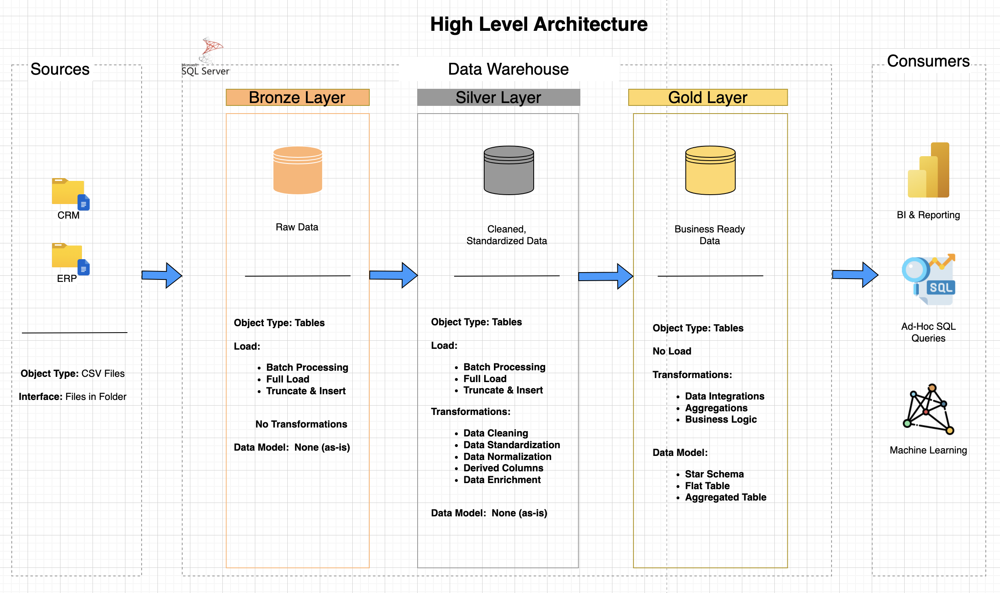

# Data Warehouse and Analytics Project 🚀

Welcome to the Data Warehouse and Analytics Project repository!  
This project demonstrates a comprehensive data warehousing solution, covering the full pipeline from raw data ingestion to structured data modeling for analytics. It is designed as a portfolio project to showcase practical skills in data engineering, SQL, and data modeling using industry best practices.

---

## 🏗️ Data Architecture

The data architecture for this project follows the **Medallion Architecture** approach:


### Bronze Layer
Stores raw data as-is from source systems (ERP & CRM). Data is ingested directly from CSV files into SQL Server.

### Silver Layer
Performs data cleaning, standardization, and transformation to ensure data quality and consistency.

### Gold Layer
Contains business-ready data modeled into a star schema, optimized for reporting and analytics.

---

## 📖 Project Overview

This project includes:

### Data Architecture
Designing a modern data warehouse using layered architecture (Bronze → Silver → Gold).

### ETL Pipelines
Building SQL-based pipelines to extract, transform, and load data from multiple sources.

### Data Modeling
Creating fact and dimension tables to support analytical queries.

### Data Integration
Combining ERP and CRM data into a unified model for better insights.

### Data Quality Handling
Cleaning inconsistent values, handling nulls, resolving duplicates, and standardizing formats.

---

## 🛠️ Tools & Technologies

- SQL Server Express – Data warehouse hosting  
- SQL Server Management Studio (SSMS) – Querying and database management  
- Draw.io – Data architecture and modeling diagrams  
- Git & GitHub – Version control and project management  
- CSV Files – Source data  

---

## 🚀 Project Requirements

### Objective
Develop a modern data warehouse to consolidate sales data and enable analytical reporting for better decision-making.

### Key Specifications
- **Data Sources:** ERP and CRM datasets (CSV files)  
- **Data Quality:** Clean and standardize raw data before analysis  
- **Integration:** Merge multiple sources into a unified data model  
- **Scope:** Focus on current-state data (no historization)  
- **Documentation:** Provide clear and structured documentation  

---

## 📊 Analytics & Reporting (In Progress)

### Objective
Generate insights into:
- Customer Behavior  
- Product Performance  
- Sales Trends  

### ⚠️ Current Status
Exploratory Data Analysis (EDA) and dashboard development are currently in progress.

- Data has been successfully modeled and prepared for analytics  
- Next steps include:
  - Performing EDA using SQL  
  - Building interactive dashboards (Power BI)  

---

## 📂 Repository Structure
```
data-warehouse-project/
│
├── datasets/                           # Raw datasets used for the project (ERP and CRM data)
│
├── docs/                               # Documentation and diagrams
│   ├── data_architecture.png           # Architecture diagram
│   ├── data_catalog.md                 # Dataset metadata and descriptions
│   ├── data_flow.png                   # Data pipeline flow diagram
│   ├── data_integration.png            # CRM–ERP table relationships (customers, products, sales) 
│   ├── data_model.png                  # Star schema for analytics
│
├── scripts/                            # SQL scripts for ETL and transformations
│   ├── bronze/                         # Raw data ingestion scripts
│   ├── silver/                         # Data cleaning and transforming scrips
│   ├── gold/                           # Analytical model creation scripts
│
├── tests/                              # Data quality checks and validation scripts
│
├── README.md                           # Project documentation
└── LICENSE                             # License information

```
---

## 🔮 Future Enhancements

This project is actively evolving. Planned improvements include:

- 📊 Exploratory Data Analysis (EDA)
- 📈 Power BI Dashboards:
  - Sales performance  
  - Customer segmentation  
  - Product trends  
- 🔄 Automated Data Pipelines  
- 🧠 Advanced Data Modeling with KPIs  
- 🧪 Enhanced Data Quality Framework  

---

## 🧠 Key Learnings

Through this project, I developed hands-on experience in:

- Designing layered data architectures  
- Writing complex SQL transformations  
- Handling real-world data quality issues  
- Building scalable and structured data models  
- Integrating multiple data sources  

---

## 🌟 About Me

I am an aspiring Data Analyst with a strong foundation in data analysis and a growing interest in data engineering concepts.

My learning journey has primarily focused on data analysis, where I’ve developed skills in working with data, writing SQL queries, and deriving insights. As I progressed, I became increasingly interested in how data is structured and prepared behind the scenes, which led me to explore data engineering concepts.

This project represents my first hands-on experience with building data pipelines and designing a data warehouse using a layered architecture (Bronze, Silver, Gold). It reflects my ability to move beyond analysis into understanding how raw data is transformed into reliable, analytics-ready datasets.

I would currently describe myself as a data analyst who is actively expanding into data engineering through practical, project-based learning.

### I am continuously learning and currently improving my skills in:
- SQL for data analysis and transformation  
- Data warehousing concepts  
- Data pipeline design (ETL processes)  
- Data visualization (Power BI – upcoming focus)  
- End-to-end analytics workflows

---

## ☕ Stay Connected

- LinkedIn: (https://www.linkedin.com/in/stella-babayemi/)  
- GitHub: (https://github.com/Stella418)  

---

## 🛡️ License

This project is licensed under the MIT License.

---

## 🚀 Final Note

This project focuses on building a strong data foundation — ensuring that data is clean, structured, and ready for analysis.  
The analytics and visualization layer is the next step, and this repository will continue to evolve as those components are added.
